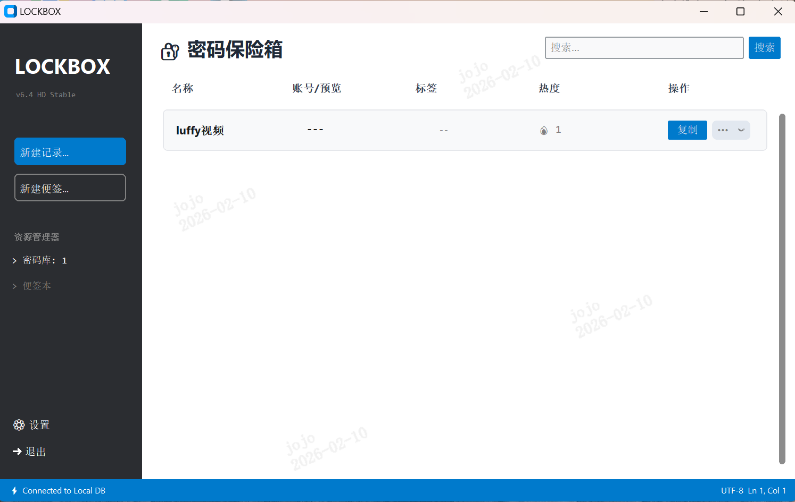

# 🔒 LockBox (安全密码箱)

> 一个极简、高颜值、开发者优先的本地密码管理工具。
>
> **安全 · 本地 · 开源 · VS Code 风格**

 
*(请在此处替换为实际软件截图)*

## 📖 简介

**LockBox** 是一个基于 Python 和 CustomTkinter 构建的桌面端密码管理与便签工具。

它专为那些厌倦了复杂的云端密码管理器、且对 UI 审美有要求的用户设计。它采用 **VS Code 风格** 的界面设计，所有数据经过 **Fernet (AES)** 加密后仅存储在你的本地设备上，绝不联网，确保绝对的数据主权。

## ✨ 核心特性

### 🎨 极致 UI 与交互
- **VS Code 风格设计**：深色/浅色主题自动切换，高对比度侧边栏，程序员最爱的界面。
- **像素级对齐**：精心调校的 Grid 布局与内边距，治愈强迫症。
- **流畅交互**：
  - 双击系统托盘图标打开/隐藏。
  - 点击右上角 `X` 最小化至托盘，常驻后台。
  - 列表文字可直接鼠标选中复制。

### 🛡️ 安全与隐私
- **本地存储**：数据存储在本地 SQLite 数据库中。
- **高强加密**：使用 `cryptography` 库的 Fernet 算法对密码进行高强度加密。
- **数据主权**：你可以随时在设置中迁移数据存储目录，完全掌控数据文件 (`.db`) 和密钥文件 (`.key`)。

### 🚀 生产力功能
- **密码管理**：支持添加、搜索、复制、删除密码；自动记录复制次数（热度）。
- **便签模式**：内置简易便签 (Memos)，方便临时记录 Token、SSH Key 等长文本。
- **智能标签**：支持多标签管理，基于 Tag Chips 的可视化编辑体验。
- **数据迁移**：
  - **导出**：支持将数据解密导出为 CSV 文件。
  - **导入**：支持从 CSV 导入，内置**智能去重**逻辑，自动跳过已存在的账号。

## 🛠️ 安装与运行

### 方式一：直接下载 (Windows)
前往 [Releases](你的GitHub仓库Releases链接) 页面下载最新的 `LockBox.exe`，无需安装 Python 环境，双击即可运行。

### 方式二：源码运行
如果你是开发者，可以克隆仓库运行：

1. **克隆仓库**
   
   ```bash
   git clone https://github.com/你的用户名/LockBox.git
   cd LockBox
   ```

2. ##### **安装依赖**

   ~~~bash
   pip install -r requirements.txt
   ~~~

3. **运行**

   ~~~bash
   python pwd_manager.py
   ~~~

   

## 📖 使用指南

1. **首次运行**：
   - 程序会引导你选择一个文件夹（建议非系统盘）来存放数据文件。
   - 生成文件：local_passwords.db (数据库) 和 secret.key (加密密钥)。
   - **注意：请务必备份好 secret.key，丢失密钥将无法解密数据！**
2. **日常使用**：
   - 点击 **New File** 添加账号密码。
   - 点击 **New Memo** 添加便签。
   - 点击列表右侧的 **Copy** 按钮一键复制密码。
   - 点击左下角的 **⚙ Manage** 进行主题切换或数据导入导出。
3. **退出程序**：
   - 点击窗口右上角 X 会最小化到系统托盘。
   - 如需彻底退出，请点击左下角的 **➜ Exit** 按钮，或在托盘图标右键选择 **Exit**。


## 📦 打包 (Build)

​		如果你想自己生成 exe 文件：

~~~bash
pip install pyinstaller
pyinstaller --noconsole --onefile --clean --name="LockBox" pwd_manager.py
~~~


